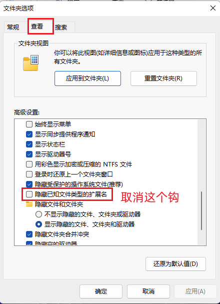
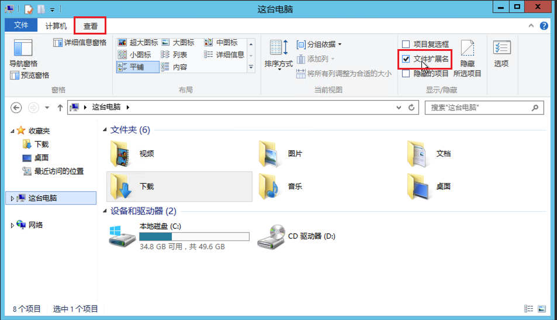

# 如何显示文件扩展名

通常而言，我们只需要在 Windows 平台上显示文件扩展名。

## Windows 11 系统

1. 打开文件资源管理器，点击右上角**三个点**，点击**选项**。

   

2. 点击上方**查看**选项卡，在下方找到**隐藏已知文件类型类型的扩展名**，将前面的钩去掉。点击**确定**即可。

   

## Windows 10 系统

打开资源管理器，点击上方**查看**选项卡，选中**文件扩展名**即可。

<Utterances />
