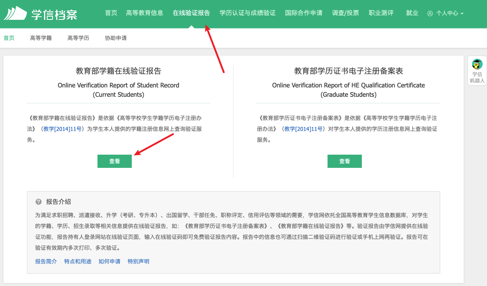
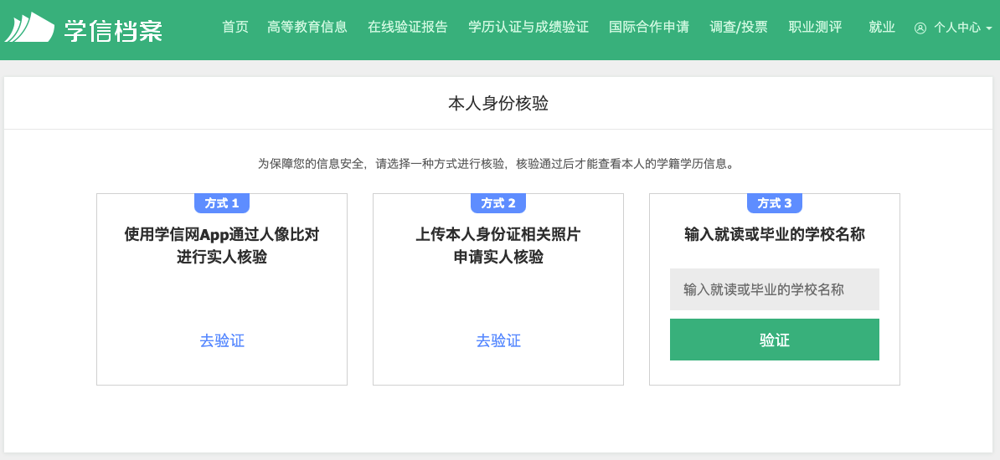

# 如何获得学信网验证码

1. 打开[学信档案官网](https://my.chsi.com.cn/archive/index.jsp)，登录学信网账号。
2. 选择**在线验证报告**，点击左侧**教育部学籍在线验证报告**下方的**查看**按钮。如果需要验证身份，根据提示验证即可。

   

   

3. 根据提示申请**在线验证报告**，申请成功后，即可看到报告出现在列表中。可以点击**查看**进入报告，对于报告进行**打印**、**下载**等操作。

   
