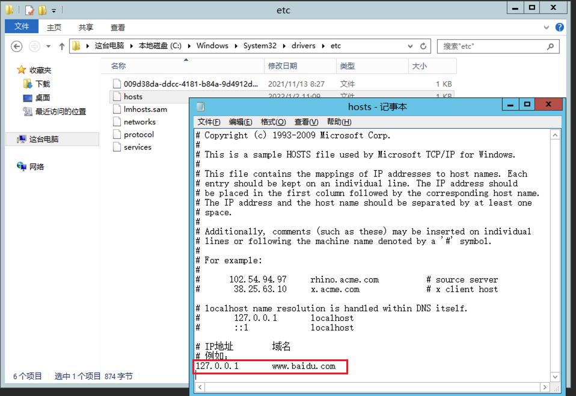
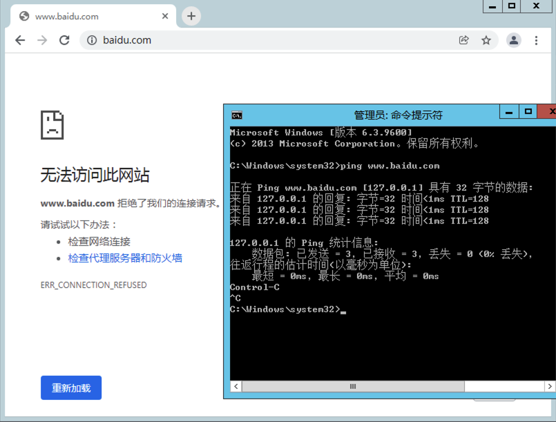
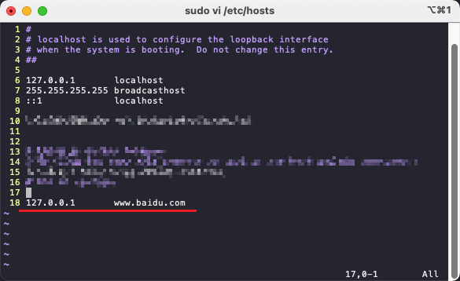
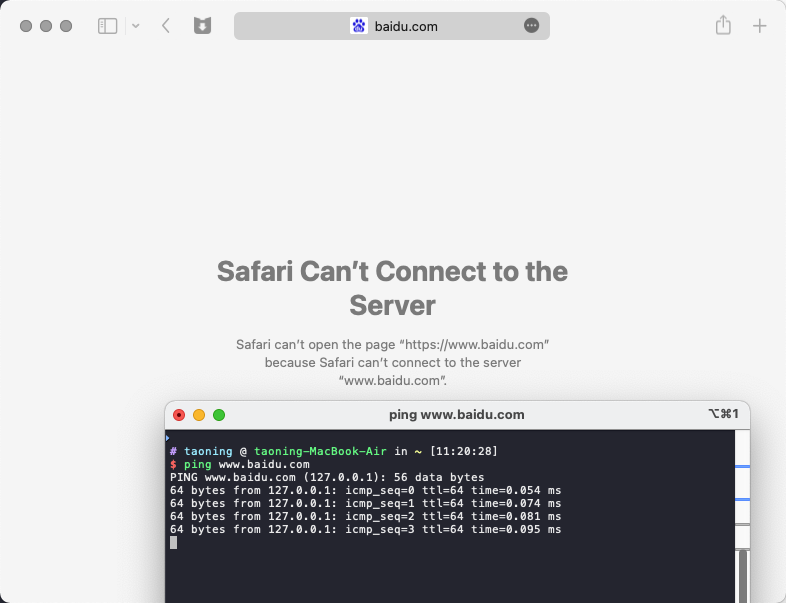

# 如何修改系统 hosts

## Windows 系统

**使用管理员身份**运行任意文本编辑器（如**记事本**），打开`C:\Windows\System32\drivers\etc\hosts`文件。

根据`IP 域名`的格式加入需要修改的域名。例如，下图中即将百度的 IP 指向了`127.0.0.1`（即本机地址）。

## Linux / macOS 系统

使用 root 权限编辑`/etc/hosts`文件。例如，如果你使用`vi`来编辑，则可以在终端中运行`sudo vi /etc/hosts`，输入密码进入。

同样以将百度指向`127.0.0.1`为例，设置完成后按`ESC`键，输入`:wq`保存并退出（对于`vi`、`vim`等编辑器而言）。

<Utterances />
