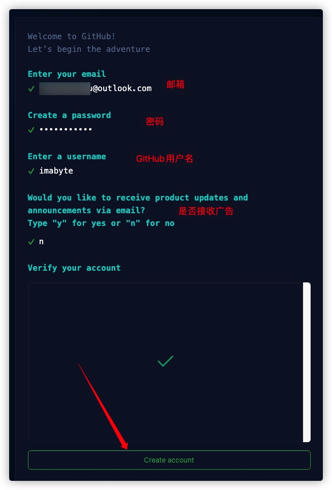

# 如何注册 GitHub 账号

打开 [GitHub](https://github.com)官网，点击右上角的**Sign up**，进入注册页面。

依次输入自己的**邮箱**、**密码**、**GitHub 用户名**，并通过**实人认证**，创建 GitHub 账户。

从邮箱中接收验证码并填入 GitHub。

可以直接跳过个性化设置。

成功注册你的个人 GitHub 账户。

