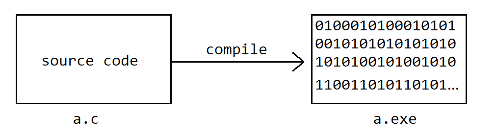
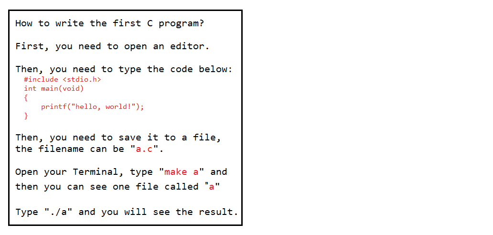

# 计算机高级语言的执行方式

**计算机高级语言**按照执行方式来分可以分为**编译型**和**解释型**这两种类型。

## 编译型语言

**编译型语言**是指使用针对特定平台的**编译器**将**源代码**「翻译」成针对该平台硬件可以执行的**机器码**，并且打包形成成该平台支持执行的可执行文件。

常见的编译型语言有：**C**、**C++**、**Go**等等。

## 解释型语言

**解释型语言**是指使用针对特定平台的**解释器**对**源代码**进行逐行「解释」成特定平台的**机器码**。**解释型语言**不需要进行**编译**，可以理解为解释型语言**边编译边执行**。

举个生活中的例子，假如你在阅读一本英文的书，你可能有如下反应：

常见的解释型语言有：**JavaScript**、**Python**、**Ruby** 等。

## 编译型与解释型语言的对比

|      | 编译型                   | 解释型                                           |
| ---- | ------------------------ | ------------------------------------------ |
| 优点 | 运行速度快               | 不需要编译，代码可以在任何带有解释器的机器上运行 |
| 缺点 | 需要针对不同平台单独编译 | 运行速度慢                                       |

总结：

**编译型语言**将程序编译后就相当于两个母语相同的人在交流。
