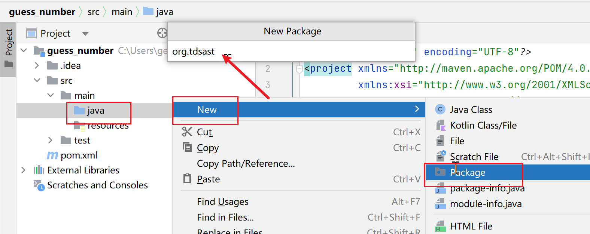
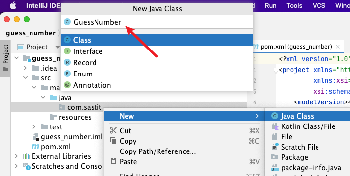
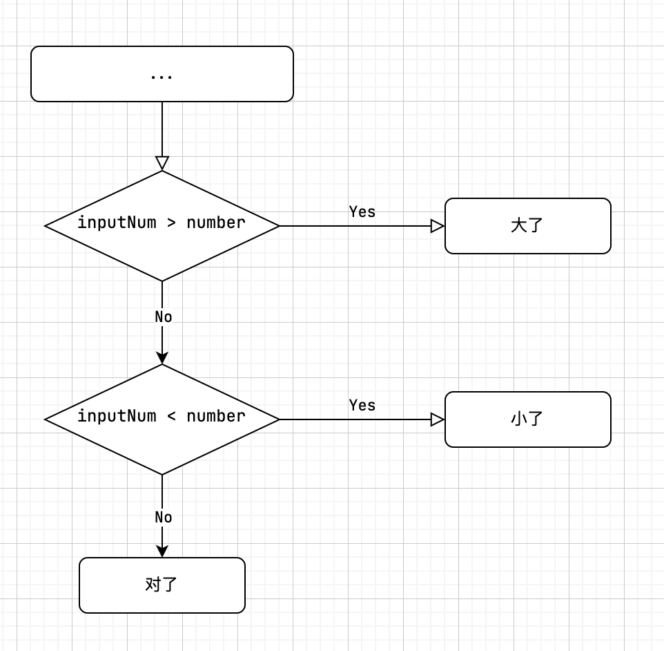

# 一个猜数字的小游戏

在 [上一节](./intro-the-first-program.md) 中，我们编写了第一个 Java 程序。这节将会以一个
**猜数字的小游戏** 为例，通过一个真实的小程序，使大家对于 Java 有更加深入的了解。

本节完整的源代码：<https://github.com/nytdc-sast-it/guess_number>

:::tip
本节主要涉及以下内容：

- IDEA 新建 Java 项目
- 使用 `Scanner` 获取用户输入
- 使用变量存储数据
- 使用 `Random` 生成随机数
- 使用 `if` 分支结构
- 使用 `while` 、 `do-while` 循环结构
- 异常处理
:::

## 准备一个新的项目

### 使用 IntelliJ IDEA 创建 Java 项目

首先按照 [上一节](./intro-introduction-of-java.md) 中的方法，使用 IntelliJ IDEA 创建一个
Java 工程。具体可以参考下图：


:::tip
这里包名写的是 `com.sastit`，下文中所有涉及包名的均以此为例。
:::

在 `src/java/` 目录下创建 `com.sastit` 包，并在其中创建 `GuessNumber` 类。





与上一节一样，IDEA 自动为我们编写了 `GuessNumber` 类的定义。在 Java 中，最基本的组成单位是
**类**。同时，第一行也多出了 `package` 语句。因为 **包** 的概念较为复杂，在本节中不再介绍。

```java
// src/main/java/com/sastit/GuessNumber.java
package com.sastit;

public class GuessNumber {
}
```

### 确保项目正确运行

我们想要使得该类成为一个可以运行的类，必须在类中添加 `main` 方法。在 IDEA 中，我们可以在类里输入
`psvm` 来快速创建 `main` 方法（`public static void main(String[] args){ }`）

在 `main` 方法中，我们可以输出一行 `Hello World` 来保证我们已经成功地创建了该项目。

```java
// src/main/java/com/sastit/GuessNumber.java
package com.sastit;

public class GuessNumber {
    public static void main(String[] args) {
        System.out.println("Hello, world!");
    }
}
```

## 获取用户猜测的数字

我们要做的第一步是获取用户输入的数字。

```java
// src/main/java/com/sastit/GuessNumber.java
package com.sastit;

import java.util.Scanner;

public class GuessNumber {
    public static void main(String[] args) {
        Scanner scanner = new Scanner(System.in);

        System.out.println("===== 猜数字游戏 =====");
        System.out.print("请输入你猜的数字：");
        int inputNum = scanner.nextInt();
        System.out.println("你刚才输入的数字是 " + inputNum);

        scanner.close();
    }
}
```

我们将 `main` 方法中的代码拆解开来看。

### 输出提示

首先，我们可以很清楚地看到两行 `print` 语句：

```java
System.out.println("===== 猜数字游戏 =====");
System.out.print("请输入你猜的数字：");
```

这两行代码虽然都是输出内容，但输出的结果是不同的。细心的朋友应该已经发现了，第一行代码使用的是 `println`
方法，而第二行使用的是 `print` 方法。`println` 中的 `ln` 代表的是 `line`，即 **打印行**，故该行代码
在执行时会在文本的最后输出一个换行。`print` 方法则不会。

### 使用变量来存储用户输入

获取用户输入主要有 3 行相关代码（此部分代码进行了部分精简，仅表示层级关系）：

```java
import java.util.Scanner;

{
    Scanner scanner = new Scanner(System.in);

    int inputNum = scanner.nextInt();

    scanner.close();
}
```

新接触 Java 的朋友可能会有点困惑，我们一行一行进行解释。为了使用 Java 标准库中的 `Scanner` 类，我们必须首先
将该类 **导入** 进来。Java 会默认导入 `java.lang` 包，故如使用到该包中的类时无需导入（注意，默认导入的是
`java.lang` 包，其下的包如 `java.lang.reflect` 仍需手动导入）。

```java
import java.util.Scanner;
```

为了使用 Scanner，我们必须首先对其进行 **初始化**（此处说法并不准确），在使用完之后，我们需要将其关闭以防止其一直使用
该资源。

```java
Scanner scanner = new Scanner(System.in);
scanner.close();
```

随后，我们使用了一个名为 `inputNum` 的 `int` 变量来存储用户输入值。变量的定义通常使用 `类型名 变量名 [= 初始值];`
的格式进行定义。后面使用了 `Scanner` 类中的实例方法 `nextInt` 来获取用户输入的整数。以下代码的含义是：定义一个
`int`（整型）的变量，名为 `inputNum`，并且将其赋值为 **用户的输入值**。

:::tip
在 Java 9 之后，我们可以通过 `var` 关键字来定义变量。该关键字可以根据 **初始值** 自动推断出变量的类型。
:::

```java
int inputNum = scanner.nextInt();

// Java 9 之后可以使用如下方法定义变量（自动推断出 `input` 变量为 `int` 类型
var inputNum = scanner.nextInt();
```

### 打印输入内容

我们可以首先用将用户输入的内容打印出来，在此代码中，我们使用 `+` 将字符串和整数进行连接。

```java
System.out.println("你刚才输入的数字是 " + inputNum);
```

### 测试第一部分的代码

到目前为止，实现出来的效果如下：

```text
===== 猜数字游戏 =====
请输入你猜的数字：666       <-- 这里的666是自己输入的
你刚才输入的数字是 666
```

## 生成一个随机数字

```java
package com.sastit;

import java.util.Random;
import java.util.Scanner;

public class GuessNumber {
    public static void main(String[] args) {
        Scanner scanner = new Scanner(System.in);

        Random random = new Random();
        int number = random.nextInt(100);
        System.out.println("生成的数字是：" + number);

        System.out.println("===== 猜数字游戏 =====");
        System.out.print("请输入你猜的数字：");
        int inputNum = scanner.nextInt();
        System.out.println("你刚才输入的数字是 " + inputNum);

        scanner.close();
    }
}

```

在 Java 中，我们可以通过 `Random` 类来生成随机数。与 `Scanner` 类一样，`Random` 类位于 `java.util`
包下，所以需要将该类导入。

```java
import java.util.Random;
```

首先，我们需要 **实例化** 一个 `Random` 对象，将该对象赋值给 `random` 变量。然后调用 `nextInt` 实例方法。
该方法有两个 **重载方法** —— `nextInt()` 和 `nextInt(int bound)`。前者会生成一个随机的整数，后者则会生成
`0 ~ bound` 之间的整数。在这个程序中，我们生成 `0 ~ 100` 之间的整数即可。最后，我们将生成的数字打印出来，
便于我们测试（在最终将会删除）。

```java
Random random = new Random();
int number = random.nextInt(100);
System.out.println("生成的数字是：" + number);
```

## 比较猜测和随机数

### if 分支

我们可以使用分支结构来比较猜测和随机数，下图展示了程序的流程图：



Java 的分支结构格式如下：

```java
// if 结构
if (condition) {
    // 当 condition 成立时执行这一段代码
}

// if-else 结构
if (condition) {
    // 当 condition 成立时执行这一段代码
} else {
    // 当 condition 不成立时执行这一段代码
}

// if-else-if-else 结构
if (condition1) {
    // 当 condition1 成立时执行这一段代码
} else if (condition2) {
    // 当 condition1 不成立，condition2 成立时执行这一段代码
} else {
    // 当 condition1 和 condition2 都不成立时执行这一段代码
}
```

了解了 Java 的分支结构，编写这部分代码就很容易了：

```java
public class GuessNumber {
    public static void main(String[] args) {
        // ...
        System.out.println("你刚才输入的数字是 " + inputNum);

        if (inputNum > number) {
            System.out.println("大了");
        } else if (inputNum < number) {
            System.out.println("小了");
        } else {
            System.out.println("猜对了");
        }

        scanner.close();
    }
}
```

### 测试第二部分的代码

运行程序，可以得到如下结果：

```text
第一次运行：
生成的数字是：43
===== 猜数字游戏 =====
请输入你猜的数字：66
你刚才输入的数字是 66
大了

--------------------------

第二次运行：
生成的数字是：75
===== 猜数字游戏 =====
请输入你猜的数字：66
你刚才输入的数字是 66
小了

--------------------------

第三次运行：
生成的数字是：23
===== 猜数字游戏 =====
请输入你猜的数字：23
你刚才输入的数字是 23
猜对了
```

## 使用循环进行多次猜测

目前我们可以发现，每当我们猜测了一个数字以后，无论对错，都会将程序退出。这是不可接受的，我们希望猜错时，
能够让用户继续输入；猜对时，则退出程序。我们可以使用 `while` 循环，结合 `break` 语句实现这一目的。

```java
public class GuessNumber {
    public static void main(String[] args) {
        // ...
        System.out.println("===== 猜数字游戏 =====");
        while (true) {
            System.out.print("请输入你猜的数字：");
            int inputNum = scanner.nextInt();
            System.out.println("你刚才输入的数字是 " + inputNum);

            if (inputNum > number) {
                System.out.println("大了");
            } else if (inputNum < number) {
                System.out.println("小了");
            } else {
                System.out.println("猜对了");
                break;
            }
        }

        scanner.close();
    }
}
```

`while` 循环的格式如下。当 `condition` 成立时，则会执行代码块里的语句。

```java
while (condition) {
    // ...
}
```

我们使用 `while (true) { ... }` 来进行循环。注意，我们这里的 `condition` 输入的是 `true`，
故如循环体内无任何控制语句时他就会一直执行循环体内的语句（俗称 **死循环**、**无限循环**）。在猜对时
执行 `break` 语句，该语句主要用于停止当前循环。

截至目前执行效果：

```text
生成的数字是：13
===== 猜数字游戏 =====
请输入你猜的数字：6
你刚才输入的数字是 6
小了
请输入你猜的数字：18
你刚才输入的数字是 18
大了
请输入你猜的数字：13
你刚才输入的数字是 13
猜对了
```

## 处理错误的输入

不知大家在执行该程序时，是否尝试过输入非数字？当我们输入非数字时，该程序报错了。随后，该程序退出。

```text
生成的数字是：39
===== 猜数字游戏 =====
请输入你猜的数字：abc
Exception in thread "main" java.util.InputMismatchException
    at java.base/java.util.Scanner.throwFor(Scanner.java:939)
    at java.base/java.util.Scanner.next(Scanner.java:1594)
    at java.base/java.util.Scanner.nextInt(Scanner.java:2258)
    at java.base/java.util.Scanner.nextInt(Scanner.java:2212)
    at com.sastit.GuessNumber.main(GuessNumber.java:17)
```

本部分则是简要的介绍 Java 的异常处理。

Java 的异常处理格式如下：

```java
try {
    // 可能产生异常的代码
} catch (异常类 异常变量名) {
    // 对异常进行处理
}
```

在如下代码中，我们将 `inputNum` 变量提取出来，并赋值为 **整型的最小值**，以便在后续的代码中
可以对 `inputNum` 变量进行访问（变量的作用域），并跳出 `do-while` 循环。`do-while` 循环
会首先执行一次 `do` 代码块中的内容，然后判断 `while` 中的 `condition` 是否成立。如果成立
则会继续执行语句块。

`try` 代码块中有一句可能会产生 `InputMismatchException` 异常的代码（即 `scanner.nextInt()`），
我们在 `catch` 中对其进行捕获，并且输出 `请输入数字！` 的字样。需要注意的是，下面必须对于错误的输入
进行清除操作（[来源](https://stackoverflow.com/questions/24857070/try-catch-inside-while-loop)），
否则程序将无限输出 `请输入数字！`。

```java
public class GuessNumber {
    public static void main(String[] args) {
        // ...

        System.out.println("===== 猜数字游戏 =====");
        while (true) {
            int inputNum = Integer.MIN_VALUE;   // 将 inputNum 初始化为整型最小值
            do {
                System.out.print("请输入你猜的数字：");
                try {
                    inputNum = scanner.nextInt();
                } catch (InputMismatchException e) {
                    System.out.println("请输入数字！");
                    scanner.next();     // 清除错误的输入
                }
            } while (inputNum == Integer.MIN_VALUE);
            System.out.println("你刚才输入的数字是 " + inputNum);

            // ...
        }
    }
}
```

该部分执行的效果如下：

```text
生成的数字是：65
===== 猜数字游戏 =====
请输入你猜的数字：sastit
请输入数字！
请输入你猜的数字：26
你刚才输入的数字是 26
小了
请输入你猜的数字：69
你刚才输入的数字是 69
大了
请输入你猜的数字：65
你刚才输入的数字是 65
猜对了
```

## 删除无用信息

终于啊终于，我们的程序总算是完成了。不过，我们需要将之前调试用的输出（比如生成的数字、
获取的用户输入）删掉。

最终的代码如下：

```java
package com.sastit;

import java.util.InputMismatchException;
import java.util.Random;
import java.util.Scanner;

public class GuessNumber {
    public static void main(String[] args) {
        Scanner scanner = new Scanner(System.in);

        Random random = new Random();
        int number = random.nextInt(100);

        System.out.println("===== 猜数字游戏 =====");
        while (true) {
            int inputNum = Integer.MIN_VALUE;
            do {
                System.out.print("请输入你猜的数字：");
                try {
                    inputNum = scanner.nextInt();
                } catch (InputMismatchException e) {
                    System.out.println("请输入数字！");
                    scanner.next();     // 清除错误的输入
                }
            } while (inputNum == Integer.MIN_VALUE);

            if (inputNum > number) {
                System.out.println("大了");
            } else if (inputNum < number) {
                System.out.println("小了");
            } else {
                System.out.println("猜对了");
                break;
            }
        }

        scanner.close();
    }
}
```

程序运行结果如下：

```text
===== 猜数字游戏 =====
请输入你猜的数字：6
小了
请输入你猜的数字：50
大了
请输入你猜的数字：25
小了
请输入你猜的数字：37
大了
请输入你猜的数字：30
猜对了
```
