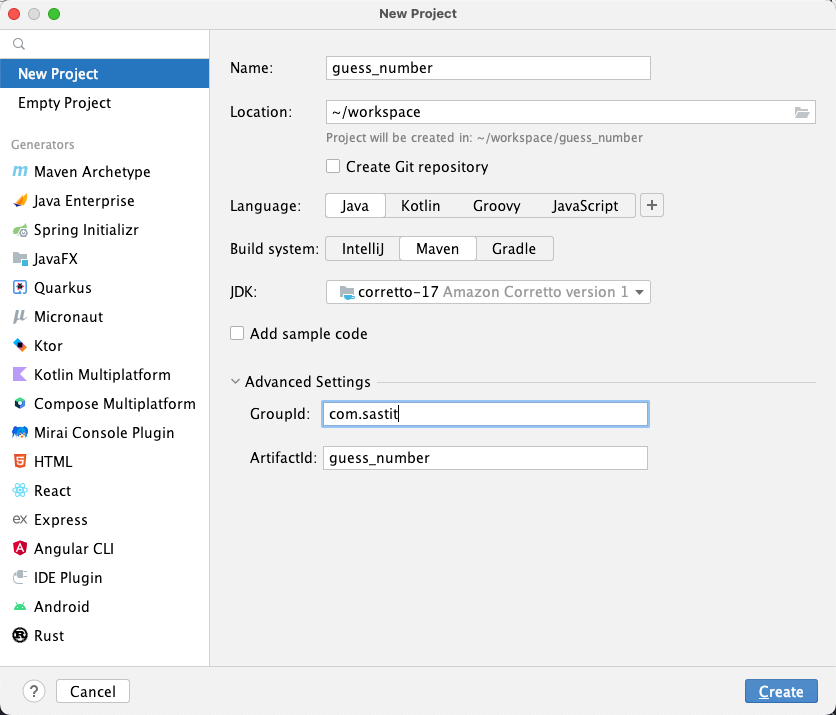

# 一个猜数字的小游戏

在 [上一节](./intro-the-first-program.md) 中，我们编写了第一个 Java 程序。这节将会以一个
**猜数字的小游戏** 为例，通过一个真实的小程序，使大家对于 Java 有更加深入的了解。

本节完整的源代码：<https://github.com/nytdc-sast/guess_number>

:::tip
本节主要涉及的 Java 内容
:::

## 准备一个新的项目

### 使用 IntelliJ IDEA 创建 Java 项目

首先按照 [上一节](./intro-introduction-of-java.md) 中的方法，使用 IntelliJ IDEA 创建一个
Java 工程。具体可以参考下图：



:::tip
这里包名写的是 `org.tdsast`，下文中所有涉及包名的均以此为例。
:::

在 `src/java/` 目录下创建 `org.tdsast` 包，并在其中创建 `GuessNumber` 类。


与上一节一样，IDEA 自动为我们编写了 `GuessNumber` 类的定义。在 Java 中，最基本的组成单位是
**类**。同时，第一行也多出了 `package` 语句。

```java
// src/main/java/org/tdsast/GuessNumber.java
package org.tdsast;

public class GuessNumber {
}
```

<!-- TODO: 介绍 package 是什么 -->

### 确保项目正确运行

我们想要使得该类成为一个可以运行的类，必须在类中添加 `main` 方法。在 IDEA 中，我们可以在类里输入
`psvm` 来快速创建 `main` 方法（`public static void main(String[] args){ }`）

在 `main` 方法中，我们可以输出一行 `Hello World` 来保证我们已经成功地创建了该项目。

```java
// src/main/java/org/tdsast/GuessNumber.java
package org.tdsast;

public class GuessNumber {
  public static void main(String[] args) {
    System.out.println("Hello, world!");
  }
}
```

## 获取用户猜测的数字

我们要做的第一步是获取用户输入的数字。

```java
// src/main/java/org/tdsast/GuessNumber.java
package org.tdsast;

import java.util.Scanner;

public class GuessNumber {
  public static void main(String[] args) {
    Scanner scanner = new Scanner(System.in);

    System.out.println("===== 猜数字游戏 =====");
    System.out.print("请输入你猜的数字：");
    int inputNum = scanner.nextInt();
    System.out.println("你刚才输入的数字是 " + inputNum);

    scanner.close();
  }
}
```

我们将 `main` 方法中的代码拆解开来看。

### 输出提示

首先，我们可以很清楚地看到两行 `print` 语句：

```java
System.out.println("===== 猜数字游戏 =====");
System.out.print("请输入你猜的数字：");
```

这两行代码虽然都是输出内容，但输出的结果是不同的。细心的朋友应该已经发现了，第一行代码使用的是 `println`
方法，而第二行使用的是 `print` 方法。`println` 中的 `ln` 代表的是 `line`，即 **打印行**，故该行代码
在执行时会在文本的最后输出一个换行。`print` 方法则不会。

### 使用变量来存储用户输入

获取用户输入主要有 3 行相关代码（此部分代码进行了部分精简，仅表示层级关系）：

```java
import java.util.Scanner;

{
  Scanner scanner = new Scanner(System.in);

  int inputNum = scanner.nextInt();

  scanner.close();
}
```

新接触 Java 的朋友可能会有点困惑，我们一行一行进行解释。为了使用 Java 标准库中的 `Scanner` 类，我们必须首先
将该类 **导入** 进来。Java 会默认导入 `java.lang` 包，故如使用到该包中的类时无需导入（注意，默认导入的是
`java.lang` 包，其下的包如 `java.lang.reflect` 仍需手动导入）。

```java
import java.util.Scanner;
```

为了使用 Scanner，我们必须首先对其进行 **初始化**（此处说法并不准确），在使用完之后，我们需要将其关闭以防止其一直使用
该资源。

```java
Scanner scanner = new Scanner(System.in);
scanner.close();
```

随后，我们使用了一个名为 `inputNum` 的 `int` 变量来存储用户输入值。变量的定义通常使用 `类型名 变量名 [= 初始值];`
的格式进行定义。后面使用了 `Scanner` 类中的实例方法 `nextInt` 来获取用户输入的整数。以下代码的含义是：定义一个
`int`（整型）的变量，名为 `inputNum`，并且将其赋值为 **用户的输入值**。

:::tip
在 Java 9 之后，我们可以通过 `var` 关键字来定义变量。该关键字可以根据 **初始值** 自动推断出变量的类型。
:::

```java
int inputNum = scanner.nextInt();

// Java 9 之后可以使用如下方法定义变量（自动推断出 `input` 变量为 `int` 类型
var inputNum = scanner.nextInt();
```

### 打印输入内容

## 生成一个随机数字

<!-- Random 类 -->

## 比较猜测和随机数

<!-- 运算符 -->

## 使用循环进行多次猜测

<!-- while 循环 -->

## 处理错误的输入

<!-- Java 异常 -->