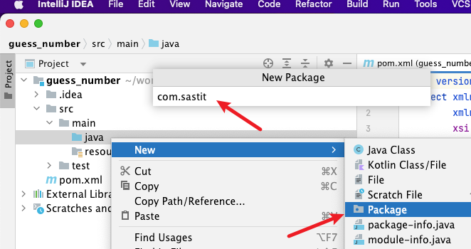

# 一个猜数字的小游戏

在 [上一节](./intro-the-first-program.md) 中，我们编写了第一个 Java 程序。这节将会以一个
**猜数字的小游戏** 为例，通过一个真实的小程序，使大家对于 Java 有更加深入的了解。

本节完整的源代码：<https://github.com/nytdc-sast/guess_number>

:::tip
本节主要涉及的 Java 内容
:::

## 准备一个新的项目

### 使用 IntelliJ IDEA 创建 Java 项目

首先按照 [上一节](./intro-introduction-of-java.md) 中的方法，使用 IntelliJ IDEA 创建一个
Java 工程。具体可以参考下图：


:::tip
这里包名写的是 `org.tdsast`，下文中所有涉及包名的均以此为例。
:::

在 `src/java/` 目录下创建 `org.tdsast` 包，并在其中创建 `GuessNumber` 类。




与上一节一样，IDEA 自动为我们编写了 `GuessNumber` 类的定义。同时，第一行也多出了 `package` 语句。

```java
// src/main/java/org/tdsast/GuessNumber.java
package org.tdsast;

public class GuessNumber {
}
```

<!-- TODO: 介绍 package 是什么 -->

### 确保项目正确运行

我们想要使得该类成为一个可以运行的类，必须在类中添加 `main` 方法。在 IDEA 中，我们可以在类里输入
`psvm` 来快速创建 `main` 方法（`public static void main(String[] args){ }`）

在 `main` 方法中，我们可以输出一行 `Hello World` 来保证我们已经成功地创建了该项目。

```java
// src/main/java/org/tdsast/GuessNumber.java
package org.tdsast;

public class GuessNumber {
  public static void main(String[] args) {
    System.out.println("Hello, world!");
  }
}
```

## 获取用户猜测的数字

我们要做的第一步是获取用户输入的数字。

```java
// src/main/java/org/tdsast/GuessNumber.java
package org.tdsast;

import java.util.Scanner;

public class GuessNumber {
  public static void main(String[] args) {
    Scanner scanner = new Scanner(System.in);

    System.out.println("===== 猜数字游戏 =====");
    System.out.print("请输入你猜的数字：");
    int inputNum = scanner.nextInt();
    System.out.println("你刚才输入的数字是 " + inputNum);

    scanner.close();
  }
}
```

我们将 `main` 方法中的代码拆解开来看。

### 输出提示

### 使用变量来存储用户输入

## 生成一个随机数字

<!-- Random 类 -->

## 比较猜测和随机数

<!-- 运算符 -->

## 使用循环进行多次猜测

<!-- while 循环 -->

## 处理错误的输入

<!-- Java 异常 -->