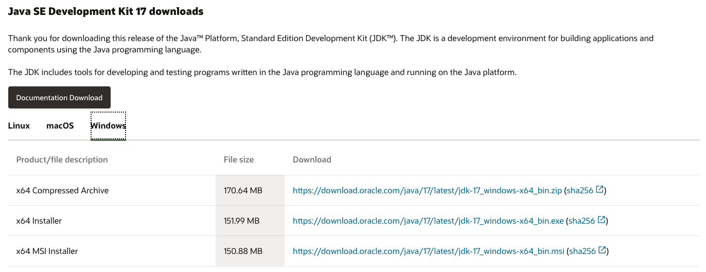

# 如何安装 Java

在 Java 世界中，有不同厂商提供的 JDK 可供使用。例如[OpenJDK](https://jdk.java.net/17/)、[Oracle JDK](https://www.oracle.com/java/technologies/downloads/)、[Azul Zulu JDK](https://www.azul.com/downloads/?package=jdk)、[Temurin（原 AdoptOpenJDK）](https://adoptium.net/)等等。他们的使用协议各不相同，有些商业用途需要付费。

作为开发人员，我们使用最多的则为[Oracle JDK](https://www.oracle.com/java/technologies/downloads/)，本文也以 Oracle JDK 安装作为演示。

**注意：从 Java 17 开始，Oracle JDK 不再收费。**（[来源](https://blogs.oracle.com/java/post/free-java-license)）

## Windows 平台

### JDK 下载

进入[Oracle JDK](https://www.oracle.com/java/technologies/downloads/)官网，切换到 Windows 选项卡，选择合适的版本进行下载。



当然，如果你嫌麻烦的话呢，可以直接点击下方链接进行下载。

- [压缩包](https://download.oracle.com/java/17/latest/jdk-17_windows-x64_bin.zip)
- [安装包](https://download.oracle.com/java/17/latest/jdk-17_windows-x64_bin.exe)
- [MSI 包](https://download.oracle.com/java/17/latest/jdk-17_windows-x64_bin.msi)

下载完成后**解压**/**安装**到某个目录中，如`C:\Develop\jdk-17`

### 环境变量配置

[如何设置系统环境变量](../articles/a-how-to-set-system-env-var.md)

1. 添加`JAVA_HOME`，指向`C:\Develop\jdk-17`
2. 在`Path`变量中加入`%JAVA_HOME%\bin`

## macOS 平台

### JDK 下载

- [ARM 版压缩包](https://download.oracle.com/java/17/latest/jdk-17_macos-aarch64_bin.tar.gz)
- [ARM 版安装包](https://download.oracle.com/java/17/latest/jdk-17_macos-aarch64_bin.dmg)（推荐）
- [x64 版压缩包](https://download.oracle.com/java/17/latest/jdk-17_macos-x64_bin.tar.gz)
- [x64 版安装包](https://download.oracle.com/java/17/latest/jdk-17_macos-x64_bin.dmg)（推荐）

注意：

1. 使用 ARM 架构芯片的 MacBook（如 M1）请选择 ARM 版 JDK（x64 版用 Rosetta 2 转译运行那速度不忍直视）。
2. 使用压缩版的 JDK 需要将其解压到合适的目录，如`~/Develop/jdk-17`

### 环境变量配置

用任意文本编辑器打开`~/.bash_profile`或`~/.zprofile`，在最后一行加入以下内容：

```bash
export JAVA_HOME="/Users/[用户名]/Develop/jdk-17" # 压缩版请使用这一条
export JAVA_HOME=`/usr/libexec/java_home -v 17`  # 安装版请使用这一条
export PATH=$JAVA_HOME/bin:$PATH
```

## 安装后的检测

打开系统上的命令行（如 **Windows** 中**命令提示符**，**macOS**中 **Terminal**），输入`java -version`，如能正确显示 JDK 版本信息，则证明 JDK 安装、环境变量配置成功。

```bash
$ java -version
java version "17" 2021-09-14 LTS
Java(TM) SE Runtime Environment (build 17+35-LTS-2724)
Java HotSpot(TM) 64-Bit Server VM (build 17+35-LTS-2724, mixed mode, sharing)
```
