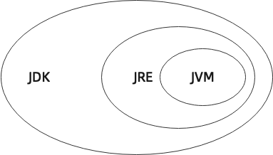

# Java 简介

## 什么是 Java

> Java 是一种全世界广泛使用的编程语言，具有跨平台、面向对象、泛型等特性，广泛应用于企业级 Web 应用开发及移动应用开发。

行吧，我承认以上内容大家是不会看的，下面我直接说下重点。

- Java 在世界范围内受欢迎程度始终位于前列，见[TIOBE 编程语言排行榜](https://www.tiobe.com/tiobe-index/)。
- Java 市场需求量大，见各大招聘网站。
- Java 跨平台，一次编写，到处运行。
- Java 具有内存回收机制。
- Java ……

## Java 的历史

Java 的诞生可以说是对于 C/C++ 语言的反抗。其没有 C 语言的指针，不用考虑内存管理，完全支持跨平台。

最初该编程语言的命名为`C++--`，即在 C++的基础上做一些改进。后来创始人发现设计理念差别太大，故将其命名为`Oak`。待编程语言发布的时候，发现 Oak 商标已被别人使用，最终命名 `Java`。

Java 逐步出名之后，一些商业巨头（如 [Oracle](https://www.oracle.com/index.html)、[Microsoft](https://www.microsoft.com/zh-cn/)）纷纷与 Java 合作。其中 [Bill Gates](https://en.wikipedia.org/wiki/Bill_Gates)（微软创始人） 称 Java 是迄今为止设计得最好的语言。

2006 年 [Hadoop](https://hadoop.apache.org/) 框架的出现，使得 Java 进军大数据领域。

2008 年 [Android](https://www.android.com/) 系统的诞生，更是使得 Java 进入了全新的高度，Android 中的应用由 Java 开发。

## Java 的版本

Java 主要有 3 个版本：

- **Java SE**（Standard Edition）
- **Java EE**（Enterprise Edition）（现在为 Jakarta EE）
- **Java ME**（Micro Edition）

**Java SE** 为标准版，提供标准 JVM 和标准库。

**Java EE** 为企业版，在 Java SE 的基础上加入了大量的 API 和类库，使其方便 Web 应用、数据库等服务的开发。其使用的虚拟机与 Java SE 完全相同。Java EE 在 2018 年已被 Oracle 公司转交给 [Eclipse 基金会](https://www.eclipse.org/org/foundation/)管理，并改名为 Jakarta EE。

**Java ME** 则为一种“瘦身版”，是一个针对嵌入式设备的版本。

## 几个名词

在刚接触 Java 的时候，你一定听到下面几个名字：

- **JDK**（Java Development Kit）
- **JRE**（Java Runtime Environment）
- **JVM**（Java Virtual Machine）

下图为这三者的关系：

<Utterances />
