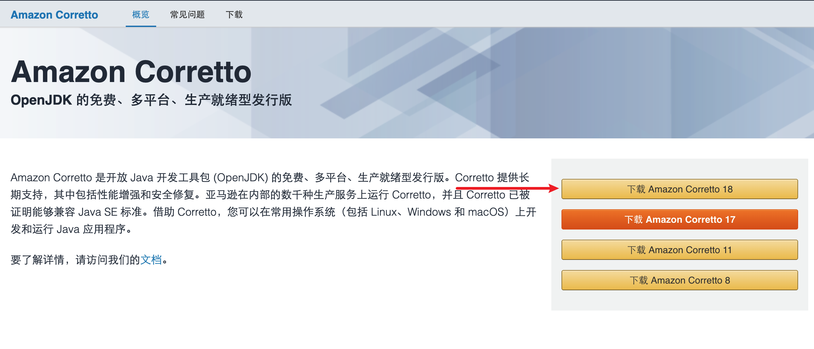
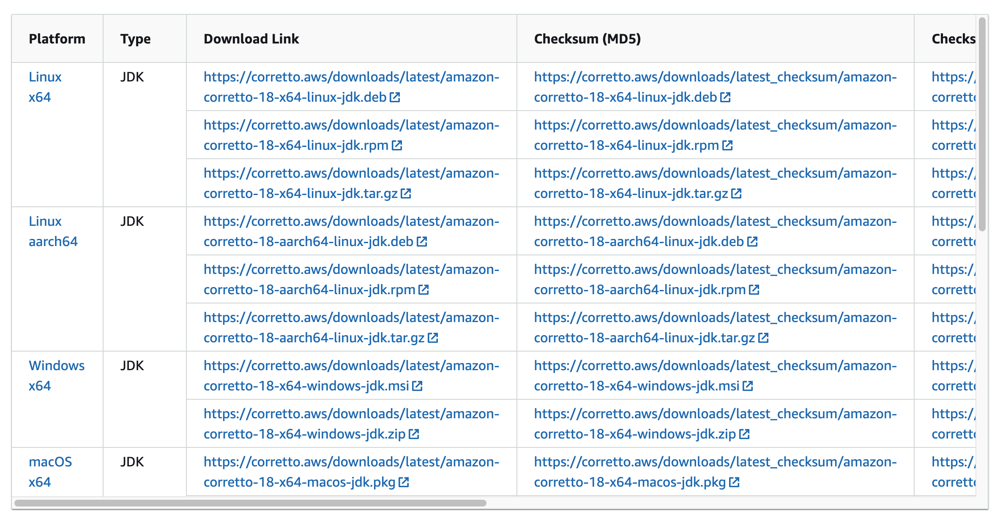
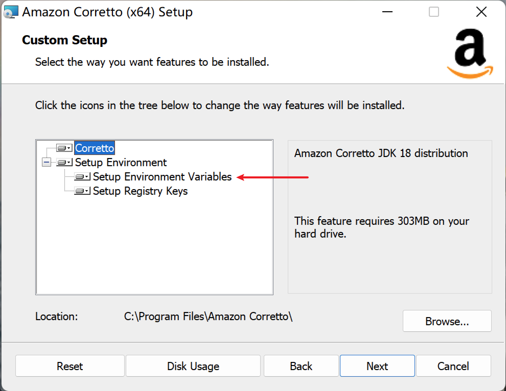
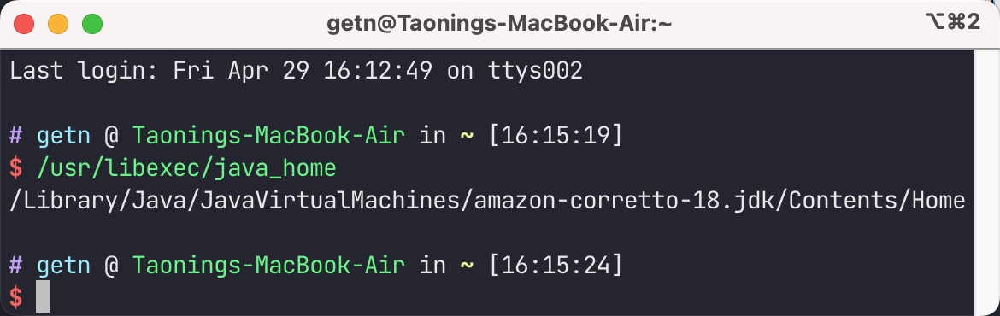
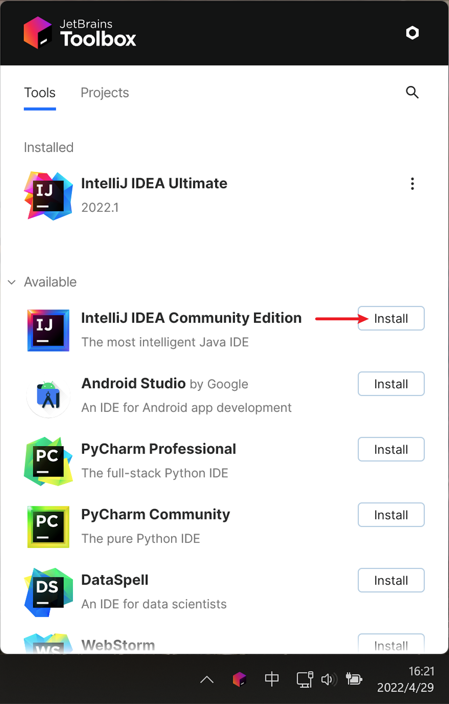

# Java 开发环境配置

## JDK 下载及安装

在正式开发 Java 程序之前，我们必须先安装好 JDK (Java Development Kit，Java 开发工具包)，
本文将使用 [Amazon Corretto JDK](https://aws.amazon.com/cn/corretto/) 作为演示，
其他 **Vendor**(供应商) 的 JDK 安装方式也大同小异。

:::tip
通常称提供不同 JDK 实现的厂商称为 **Vender**。
:::

打开 Corretto JDK 的官网，选择所需要的 Java 版本（这里以 Java 18 为例），进入下载页面。

根据自己的系统选择相应的版本，下载完成后安装即可。

:::tip
注意，Windows 系统安装时会自动添加 `JAVA_HOME` 和 `PATH` 环境变量，如不想手动设置必须将其选中。

:::

## JDK 环境变量配置

[如何配置环境变量](../articles/a-how-to-set-system-env-var.md)

- 设置 `JAVA_HOME` 环境变量为 Java 安装根目录

  如 `C:\Java\jdk18` (Windows 平台) 或 `~/Develop/java/jdk18` (Linux 平台)
  或 `~/Develop/java/jdk18/Contents/Home` (macOS 平台)
- 在 `PATH` 中加入一条 `%JAVA_HOME%\bin`(Windows平台) 或 `$JAVA_HOME/bin`(Linux / macOS 平台)

macOS 可通过 `/usr/libexec/java_home -v 18` 命令来获取 `JAVA_HOME` 路径

:::tip

1. 在 macOS 系统上安装 Java 后，将会自动创建 `/usr/libexec/java_home` 工具。
2. `java_home` 工具可以使用 `-v [版本号]` 参数来指定需要获取 `JAVA_HOME` 的版本。
:::

## 安装 IntelliJ IDEA

IntelliJ IDEA 可从 <https://www.jetbrains.com/idea/> 获取下载。方便起见，我们常常使用 JetBrains
提供的 [Toolbox](https://www.jetbrains.com/idea/) 来管理 JetBrains 家族各个 IDE 的版本。

安装 Toolbox 后，安装需要的 IDE 即可。

:::tip
JetBrains 公司面向大学生提供了学生优惠，可免费使用 JetBrains 旗下所有 IDE 工具。

[JetBrains 免费计划](https://www.jetbrains.com/zh-cn/community/education/#students)
[学信网验证码获取](../articles/a-how-to-get-chsi-code.md)
:::
