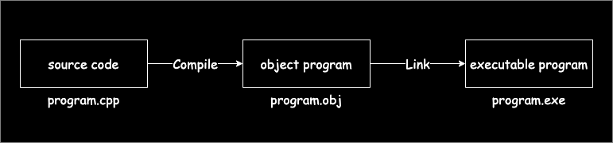
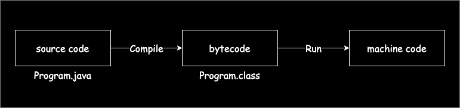

# Java 运行机制

## 高级语言运行机制

目前世界上的高级语言主要有两种运行机制：**编译型**、**解释型**。
编译型语言需要首先将源代码通过特定的工具“编译”后生成对应平台的可执行程序（或者叫二进制程序、机器码）才能够运行，常见的编译型语言如：
**C**、**C++**、**Delphi** 等。解释型语言则通过解释器将源代码解释为对应平台的机器码，效率较低，常见的解释型语言如：**Python**、
**Ruby**、**JavaScript** 等。

下图是一个典型的 C++ 程序的运行机制：

## Java 语言运行机制

Java 既不属于编译型语言也不属于解释型语言。Java 程序在编译的过程中，生成与平台无关的 **字节码**(Bytecode) 文件，该文件只能通过 JVM
（Java Virtual Machine, Java 虚拟机）运行。

下图是 Java 的运行流程图：

> 市面上也存在将 Java 代码直接编译成机器码的技术，比如 Oracle 的 [GraalVM](https://www.graalvm.org)，但相对处于市场初期，故不在讨论范围之内。
