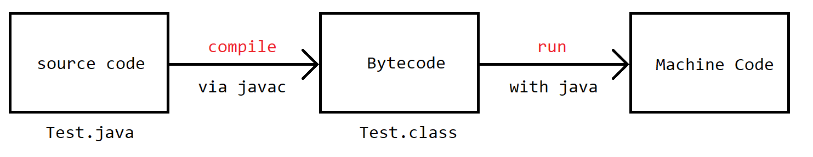

# 第一个 Java 程序

## 代码编写及运行

首先，打开任意一个代码编辑器或 IDE（例如 [Sublime](https://www.sublimetext.com/)、[IntelliJ IDEA](https://www.jetbrains.com.cn/idea/)，
**强烈不建议使用 Windows 自带的记事本，更不要使用 Word** ），输入以下代码：

```java
public class Hello {
  public static void main(String[] args){
    System.out.println("Hello, Java!");
  }
}
```

将其保存为`Hello.java`文件，打开终端（Windows 建议使用 [Powershell](https://docs.microsoft.com/en-us/powershell/)
或[Git Bash](https://git-scm.com/download/win) ），定位到代码保存目录，输入`javac Hello.java`。

如果代码准确无误，则无任何输出。你将在当前目录下看到`Hello.class`的文件。

```bash
$ javac Hello.java
$ ls
Hello.class Hello.java
```

接下来，输入`java Hello`，你将看到以下输出：

```bash
$ java Hello.java
Hello, Java!
```

## 分析第一个程序

在任何一个 Java 程序中，你都能找到如下代码：

```java
public class Hello { ... }
```

该代码定义了一个名为`Hello`的类（class），`public`代表这是一个**公开**的类。

在`Hello`的类中，我们还定义了一个名为`main`的方法：

```java
public static void main(String[] args){
    System.out.println("Hello, Java!");
}
```

`main`方法为一个 Java 程序的入口方法，其中的`String[] args`表示该方法接受一个`String[]`类型的参数，`public`、`static`为修饰符，关于修饰符相关的内容将在后面讲到。

`System.out.println("Hello, Java!");`代表将`Hello, Java!`打印在控制台上。

在 Java 中，每个 Java 语句的结束都需要以分号（`;`）结尾。

## Java 运行机制

Java 源代码本质上是一个纯文本文件，我们通过`javac`命令将源代码编译成[字节码](https://baike.baidu.com/item/%E5%AD%97%E8%8A%82%E7%A0%81/9953683)文件，再通过`java`命令执行该字节码文件。

大概的运行机制如下图所示：


