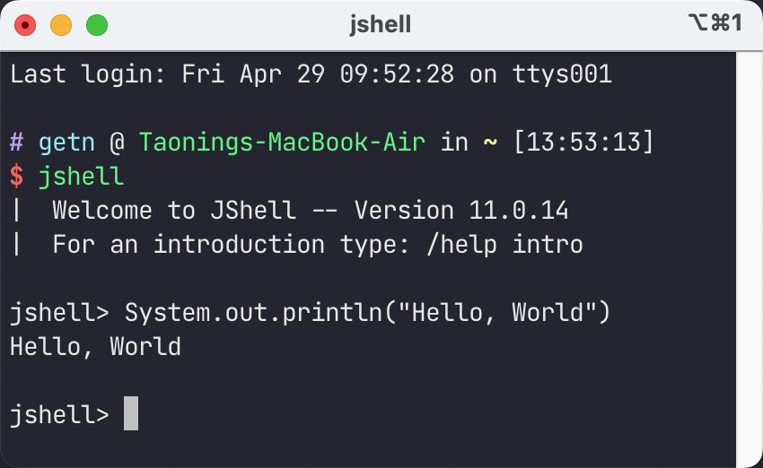
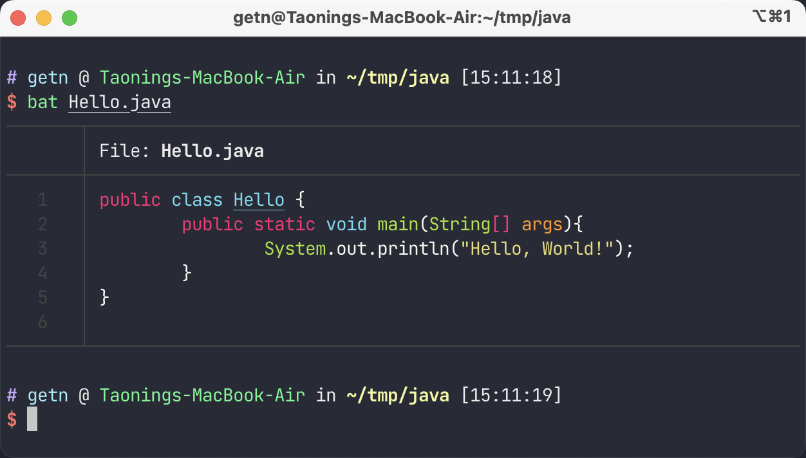
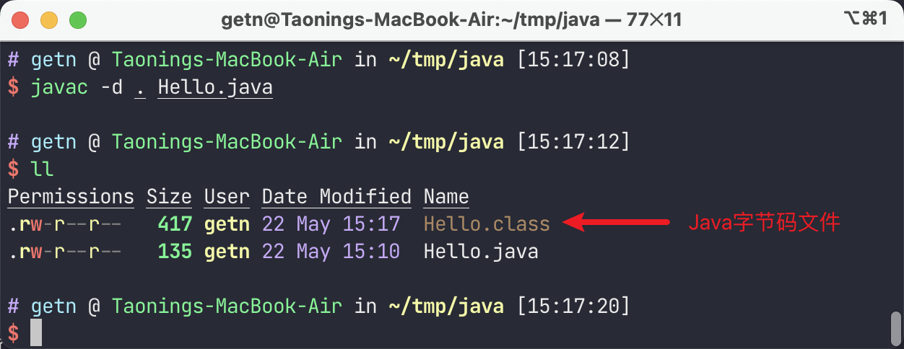
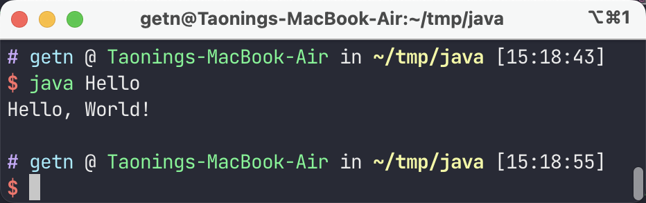
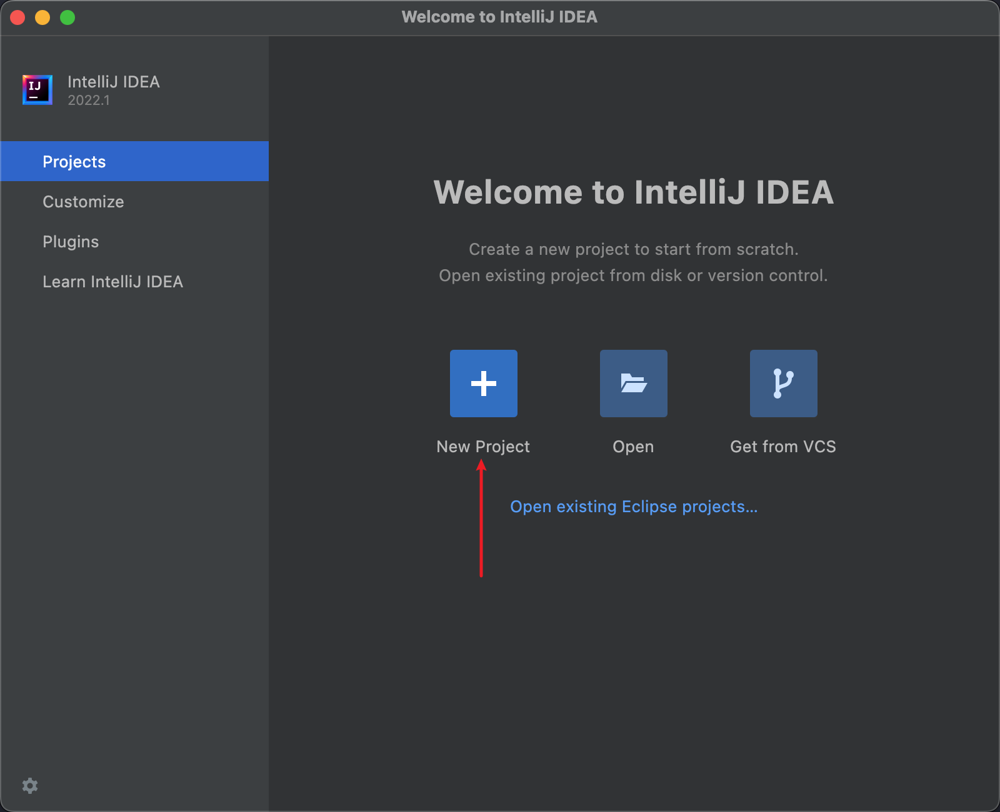
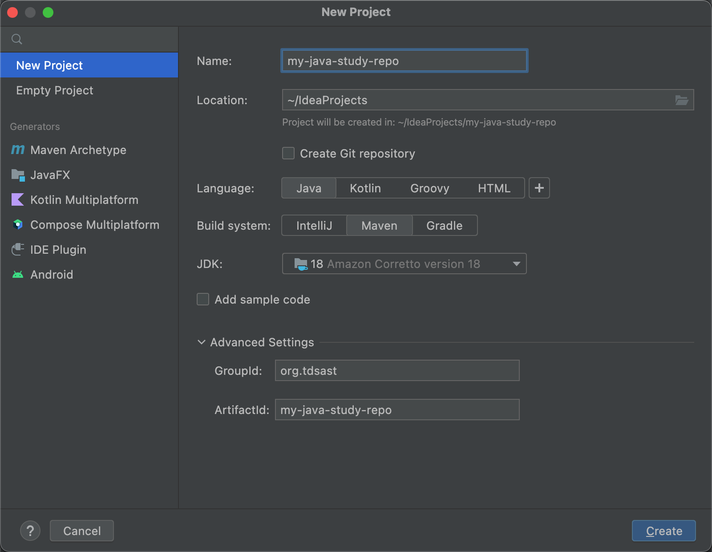
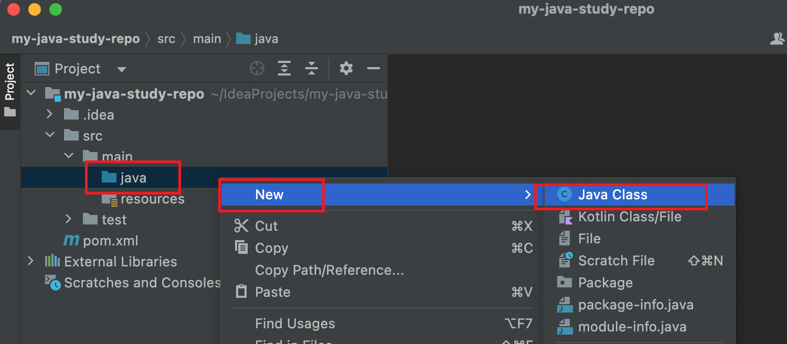
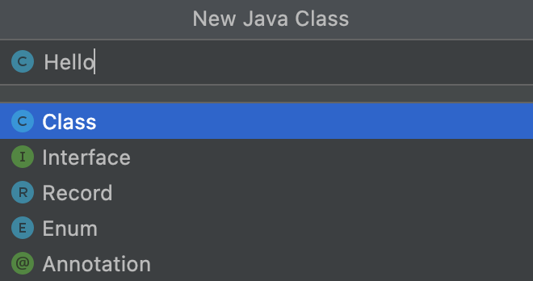
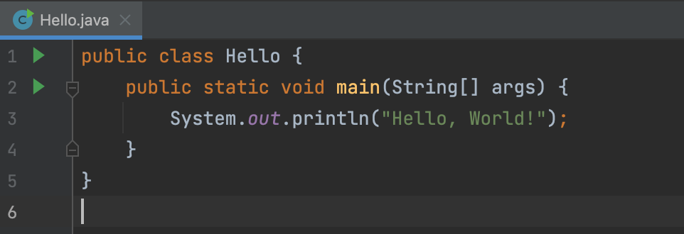
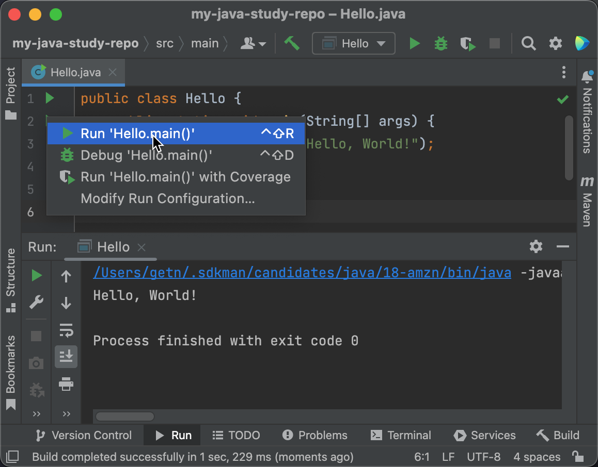

# 第一个 Java 程序

## 使用 jshell 运行第一个程序

从 Java 9 开始，JDK 内置了一个强大的 REPL(Read-Eval-Print Loop) 交互式工具，该工具是个交互式的命令行界面，
可以用来执行 Java 的变量声明、语句和表达式，并且可以立即看到结果。

我们第一个程序就从 jshell开始。

:::tip
如果你已安装 Java 并成功配置了 Java 的环境变量，那么可以在任意终端（如 macOS / Linux 上的 `Terminal`，
Windows 上的 `cmd`、`Powershell`、`git-bash`）中输入 `jshell` 运行。
:::

在 jshell 工具中，输入 `System.out.println("Hello, World")`，即可得到 `Hello, World` 的字样。这就是我们
使用 jshell 编写的第一个 Java 程序。



## 通过命令行编译第一个程序

我们在使用 IDE 学习 Java 之前，我们必须首先手动地体验一下如何使用 Java 提供的工具来手动编译程序。

既然要编译程序，那么必然需要有程序代码供我们编译。我们首先在任意目录（这里以 `~/tmp/java/` 为例子）
创建名为 `Hello.java` 的文件。在该文件中输入如下代码：

```java
public class Hello {
  public static void main(String[] args) {
    System.out.println("Hello, World!");
  }
}
```

:::tip
必须使用纯文本编辑器（如 [VSCode](https://code.visualstudio.com)、[Sublime Text](https://www.sublimetext.com/)）
来编写程序，**绝对** 不可以使用任何带有格式的编辑器（如 Word、写字板）等软件编写。

同时，不推荐使用 Windows 自带的 记事本 来编写程序。
:::



在当前目录下打开任意终端（如 Windows 的 `cmd`、`Powershell`、`git-bash`，macOS / Linux 的
`Terminal`），在命令行窗口中输入 `javac -d . Hello.java`。此命令将会将 Java 源代码编译成
Java 字节码文件。



执行 `java Hello` 命令，运行该 Java 程序（事实上运行的是 `Hello` 这个类）



:::tip
注意，执行 `java` 命令时后面接的是类名，不需要添加 `.class`。
:::

## 使用 IntelliJ IDEA 开发第一个程序

IntelliJ IDEA 是目前 **最为强大**，使用 **最为广泛** 的 Java 开发工具，我们十分推荐初学者使用他。

:::tip
不推荐各初学者相信所谓 “初学阶段使用记事本” 的论调。
:::

在 [Java 开发环境配置](./intro-java-dev-env.md) 中，我们已经安装了 IntelliJ IDEA工具，打开之
并点击界面上的 **New Project** 新建一个新的工程。



新建一个 Java 项目：

- `Name`：项目名，主要作为标识
- `Location`：项目存放位置，默认存放在当前用户目录的 `IdeaProjects` 目录下，可以修改为自己希望存放的位置。
- `Create Git repository`：创建 Git 仓库，目前还未接触到 Git，故该选项可暂时忽略。
- `Lanuage`：编程语言，你说选什么？
- `Build system`：构建系统，通用起见，我们选择 `Maven`。关于 `Maven` 的知识将在后续的文章中讲到。
- `JDK`：选择项目使用的 JDK 版本。
- `Add sample code`：添加样例代码，选中后将在项目中自动添加 Hello World 代码。
- `Advanced Settings`：高级设置
  - `GroupId`：组名，通常为域名反写，此处目前而言默认即可
  - `ArtifactId`：构建名称，可默认。

填写完成后点击 `Create`(创建) 即可。



在 `src/main/java` 目录下右键，点击 `New - Java Class`，创建一个 Java 类。



在弹出的对话框中输入 `Hello`，确保下方选项选中 `Class`，即创建一个名为 `Hello`的 **类**。



随后在代码框中输入：

```java
public class Hello {
  public static void main(String[] args) {
    System.out.println("Hello, World!");
  }
}
```

:::tip
事实上，我们创建的是一个 class，故 IDEA 会自动创建 `public class Hello { }`。
:::



随后，点击 **class** 前或 **main** 方法前的 **播放器图标**，点击 `Run 'Hello.main()'`，
在下方的控制台中即将显示 `Hello, World!` 字样。



:::tip
在后续的学习中，完全可以在该项目的基础上创建多个 **类** 来编写各种各样的代码。
:::

## 分析第一个程序

在任何一个 Java 项目中，你都能找到形如 `public class Hello { ... }` 的代码。
该代码定义了一个名为 `Hello` 的 **类**(`class`)，`public` 关键字代表了这是
一个 **公开** 的类。

:::tip
在 Java 中，**类** 是最小的单位。
:::

在类中，我们定义了一个 `main` 方法。`public static void main(String[] args) { ... }`
是一个 Java程序的入口，不能修改。

`System.out.println("Hello, World");` 是 Java 的语句，表示将 `Hello, World`
字符串输出在控制台上。

每一个 Java 语句都必须以 **分号**(`;`) 结尾。
